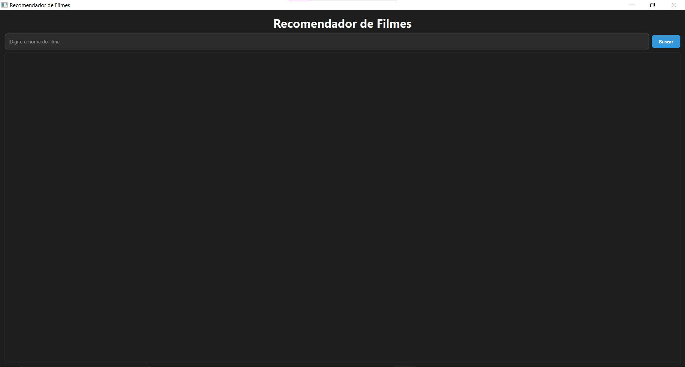

# TMDB Movie Recommender


Este projeto é um programa em Python que utiliza a [API TMDB](https://www.themoviedb.org/) para recomendar os 10 melhores filmes semelhantes ao filme informado pelo usuário. Além da funcionalidade de recomendação, foi implementada uma interface gráfica utilizando PyQt5 para melhorar a experiência do usuário.

## Projeto Original
O projeto original pode ser encontrado no GitHub do professor [João Paulo Aramuni](https://github.com/joaopauloaramuni/python/tree/main/PROJETOS/Projeto%20MoviesWithTMDBApi). 

## Funcionalidades

- Pesquisa o ID de um filme a partir do seu nome.
- Obtém uma lista de filmes semelhantes utilizando a API TMDB.
- Classifica e exibe os 10 melhores filmes semelhantes, com base na pontuação média (`vote_average`).
- Interface gráfica com PyQt5 para facilitar a interação e visualização dos resultados.

## Tecnologias Utilizadas

- **Python**: Linguagem de programação principal.
- **Requests**: Biblioteca para realizar chamadas HTTP.
- **PyQt5**: Framework para criar a interface gráfica.
- **LRU Cache**: Para otimizar o carregamento de imagens.

## Requisitos

1. **Python 3.7 ou superior**
2. **Bibliotecas necessárias**:
   - Instale usando:
     ```bash
     pip install requests pyqt5
     ```

3. **Chave de API do TMDB**:
   - Crie uma conta em [TMDB](https://www.themoviedb.org/).
   - Acesse [Configurações de API](https://www.themoviedb.org/settings/api) e gere uma chave de API.

## Configuração

1. Clone este repositório ou copie o código.
2. Substitua a variável `API_KEY` no arquivo `main.py` pela sua chave de API do TMDB:
   ```python
   API_KEY = 'sua_chave_api_aqui'
   ```

## Como Executar

1. Execute o script da interface gráfica:
   ```bash
   python3 interface.py
   ```
2. Insira o nome de um filme no campo de busca e pressione **Buscar**.

## Exemplo de uso (Interface Gráfica):

- **Entrada**: Digite "Harry Potter" na interface.
- **Saída**: Uma grade de filmes semelhantes é exibida com:
  - Pôster do filme.
  - Nome.
  - Nota média.
  - Data de lançamento.

  ## Capturas de Tela

|  |  |
|:----------------------------------------------------------:|:---------------------------------------------------------:|
|                          Home                              |                        Home - Carregando Informações                         |
|     |   |
|                        Resultado da Pesquisa                            |                         Validação                          |

## Estrutura do Código

### Arquivo `main.py`

- **Funções principais**:
  - `get_movie_id(movie_name)`: Busca o ID de um filme pelo nome utilizando a API TMDB.
  - `get_similar_movies(movie_id)`: Retorna uma lista de filmes semelhantes com base no ID informado.
  - `recommend_movies(movie_name)`: Exibe os 10 melhores filmes semelhantes, ordenados pela nota.

### Arquivo `interface.py`

- **Interface gráfica**: Desenvolvida com PyQt5, incluindo:
  - Campo de busca para o nome do filme.
  - Grade responsiva de resultados com pôsteres e detalhes dos filmes.
  - Barra de progresso para indicar o carregamento dos resultados.

## Possíveis Problemas e Soluções

- **Erro**: Import "requests" or "PyQt5" could not be resolved.
  - Solução: Certifique-se de que as bibliotecas estão instaladas no ambiente correto:
    ```bash
    pip install requests pyqt5
    ```

- **Erro**: Invalid API key.
  - Solução: Verifique se a chave de API foi configurada corretamente no arquivo `main.py`.

## Contribuição

Contribuições são bem-vindas! Sinta-se à vontade para abrir uma issue ou enviar um pull request.
